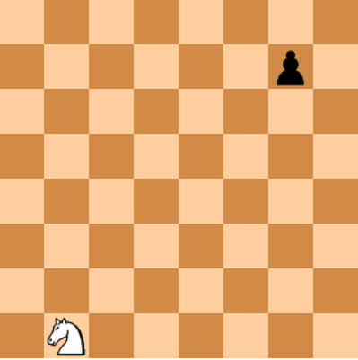
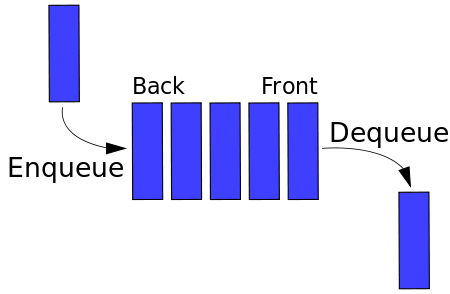
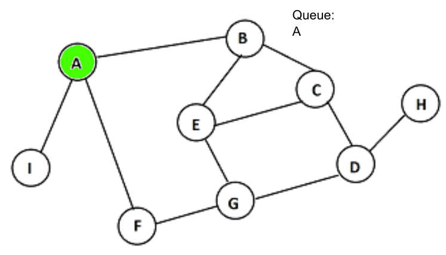
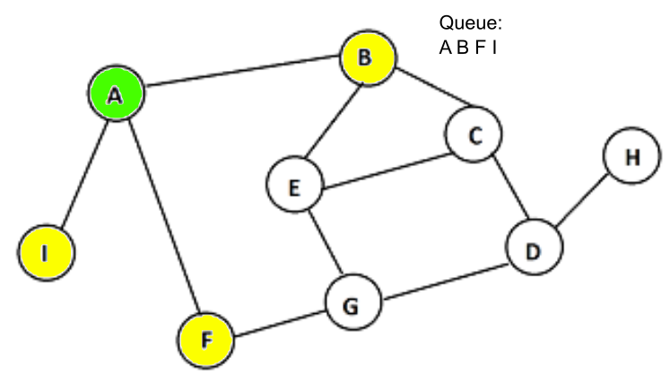
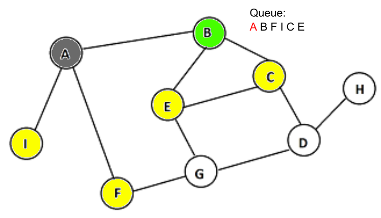
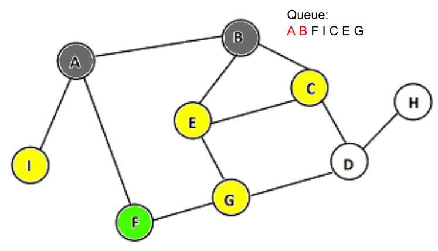
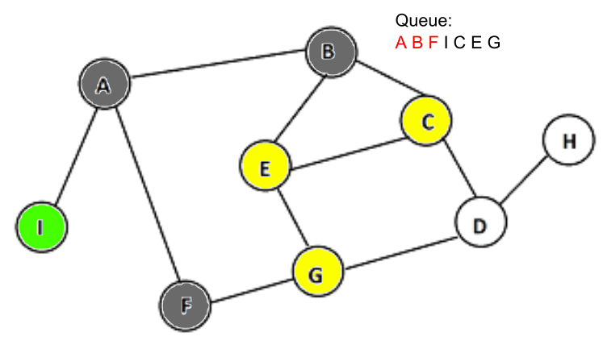
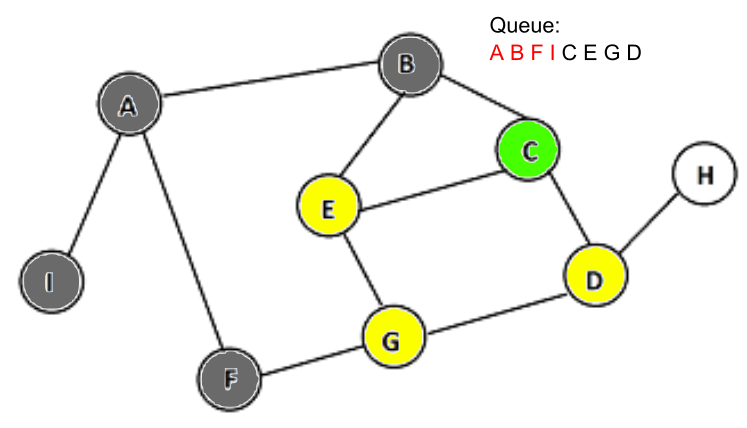
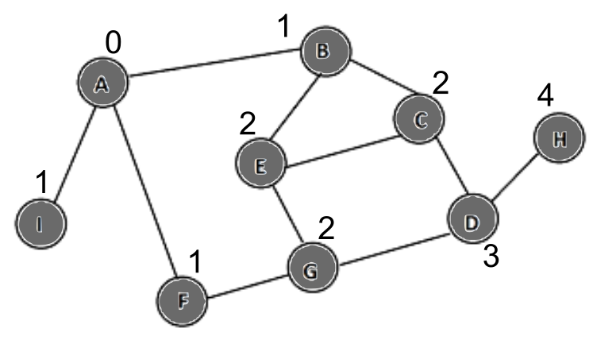

# Breadth-First Search
Let's say we wanted to find out the minimum number of steps the knight could take to get to the pawn.



We could probably determine the answer to this problem fairly quickly in our head. But how would we use a computer to solve this problem efficiently?

Breadth-first search, or simply BFS, is a search algorithm which can be used to find the minimum number of steps to get from one place to another. BFS uses a data type called a "queue", which follows a First-In-First-Out (FIFO) method. This means that the first object added into a queue will always be the first to be removed.



To start BFS, a tree node (the starting point of BFS) is added to a queue.



Its neighbors, or surrounding nodes, are then scanned and added to the queue as well.



After doing so, the tree node is then removed from the queue, and the next node in the queue is scanned for neighbors as well. This process continues until all nodes have been checked.

   
<!-- 46ff00ff (green) 6a6a6aff (grey) fcff00ff (yellow)-->
So how does this allow us to find the minimum number of steps from one node to another? We can implement a "step" or "distance" system to keep track of the distances of every node in relation to the tree node.



# Implementation

Now that we have the theory covered, we can explore a simple implementation of BFS which can serve as a template for most CCC searching problems. 

Most of the BFS problems that one would encounter at CCC would likely include a grid-like map where the distance between one point to another point must be found, with certain modifications and conditions. This means that we can store the map (if necessary) and the step values on 2D arrays. The queue could be stored on two LinkedLists to make the queue two-dimensional (one for rows, one for columns).
```Java
//INPUT
Scanner sc = new Scanner(System.in);
int N = sc.nextInt(); //size of grid (assuming it is square)
int rowStart = sc.nextInt(); //integer value of row of starting point
int colStart = sc.nextInt(); //add integer value of column of destination point
int rowEnd = sc.nextInt(); //integer value of row of starting point
int colEnd = sc.nextInt(); //integer value of column of destination point

//SETUP QUEUES AND STEP ARRAY
LinkedList<Integer> rowQueue = new LinkedList<Integer>();
LinkedList<Integer> colQueue = new LinkedList<Integer>();
rowQueue.add(rowStart); //add integer value of row of starting point to queue
colQueue.add(colStart); //add integer value of column of starting point to queue
int[][] step = new int[N][N];
for (int i = 0; i < N; i++) {
    Arrays.fill(step[i], Integer.MAX_VALUE); //fills entire 2D step array with maximum integer value; will be updated as graph is traversed
}
step[rowStart][colStart] = 0; //distance from starting point is 0

//START BFS
while (!rowQueue.isEmpty()) { //while the queue still contains values
    int r = rowQueue.poll(); //poll() extracts and removes first item (0th index) from queue (following FIFO method)
    int c = colQueue.poll();
    //CHECKING NEIGHBORS: check r - 1 (check the neighbor grid above)
    if (r - 1 >= 0 && step[r - 1][c] > step[r][c] + 1) { //checking if there neighbor grid above is out of bounds
        /*
        (step[r - 1][c] > step[r][c] + 1) checks if neighbor grid above has a higher step value than current grid
        if it does, update graph (to current grid step + 1) to ensure lowest possible step value and add to queue
        if it doesn't, don't update graph to maintain possible step value and don't add to queue
        */
        rowQueue.add(r - 1);
        rowQueue.add(c);
        step[r - 1][c] = step[r][c] + 1;
    }
    //repeat neighbor check for other directions (r - 1: up; c + 1; right; r + 1; down; c - 1; left)
}

//OUTPUT
System.out.println(step[rowEnd][colEnd]); //find distance (step value) of destination point
```
For more information and an alternative implementation, [click here](https://www.geeksforgeeks.org/breadth-first-search-or-bfs-for-a-graph/).

# Exercises
### Easy
[CCC '98 S5 - Mountain Passage](https://dmoj.ca/problem/ccc98s5)  
[CCC '10 J5 - Knight Hop](https://dmoj.ca/problem/ccc10j5)  
[The Great Escape](https://dmoj.ca/problem/valday15p3)  
### Medium
[Biridian Forest](https://codeforces.com/problemset/problem/329/B)  
[CCC '18 J5 - Choose your own path](https://dmoj.ca/src/821593)  
[DWITE '10 R4 #4 - Mountain Hiking](https://dmoj.ca/problem/dwite10c4p4)   
### Hard
[CCC '18 S3 - RoboThieves](https://dmoj.ca/problem/ccc18s3)
