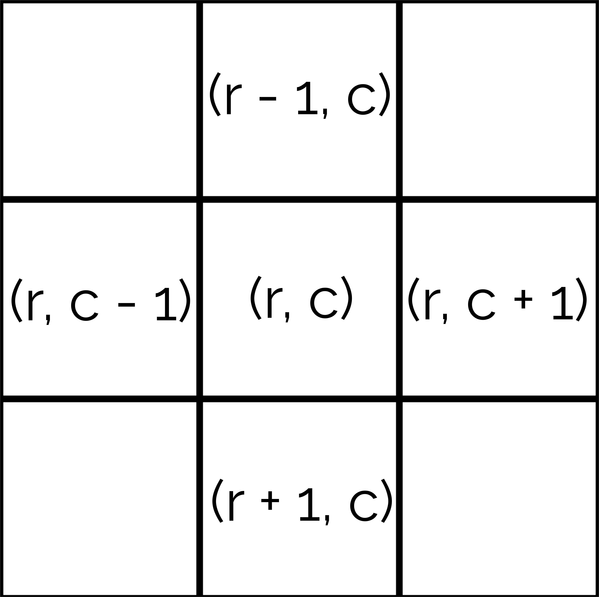

# Breadth-First Search
Let's say we wanted to find out the minimum number of steps the knight could take to get to the pawn.


We could probably determine the answer to this problem fairly quickly in our head. But how would we use a computer to solve this problem efficiently?

**Breadth-first search**, or simply BFS, is a search algorithm which can be used to find the minimum number of steps to get from one place to another. BFS uses a data type called a "**queue**", which follows a **First-In-First-Out (FIFO)** method. This means that the *first* object added into a queue will always be the *first* to be removed.


To start BFS, a tree node (the starting point of BFS) is added to a queue. This queue will store which nodes to check (and scan for neighbors) next.


Its neighbors, or surrounding nodes, are then scanned and added to the queue as well.


After doing so, the tree node is then removed from the queue, and the next node in the queue is checked and scanned for neighbors as well. This process continues until all nodes have been checked.

   
<!-- 46ff00ff (green) 6a6a6aff (grey) fcff00ff (yellow)-->
So how does this allow us to find the minimum number of steps from one node to another? We can implement a "step" or "distance" system to keep track of the distances of every node in relation to the tree node.


# Implementation

Now that we have the theory covered, we can explore a simple implementation of BFS which can serve as a template for most simple searching problems. 

Most of the simple BFS problems would likely include a grid-like map where the distance between one point to another point must be found, with certain modifications and conditions. This means that we can store the map (if necessary) and the step values on 2D arrays. The queue could be stored on two `LinkedLists` to make the queue two-dimensional (one for rows, one for columns).

## Input and Initialization
The **size** of the grid, as well as the **x- and y-coordinates** of the starting and ending points, are entered by the user using an input method (Scanner in this case).
```Java
Scanner sc = new Scanner(System.in);
int N = sc.nextInt(); //size of grid (assuming it is square)
int rowStart = sc.nextInt(); //input integer value of row of starting point
int colStart = sc.nextInt(); //input integer value of column of destination point
int rowEnd = sc.nextInt(); //input integer value of row of starting point
int colEnd = sc.nextInt(); //input integer value of column of destination point
```
Next, we have to declare and initialize the data types used to store the queue and the step array.

However, since we have to store *both* the x- and y-coordinates of the location on the grid, we will make *two* queues: one for the x-coordinates, one for the y-coordinates. Then, we will proceed to add the coordinates of the starting points to their respective queues.
```Java
LinkedList<Integer> rowQueue = new LinkedList<Integer>();
LinkedList<Integer> colQueue = new LinkedList<Integer>();
rowQueue.add(rowStart); //add integer value of row of starting point to queue
colQueue.add(colStart); //add integer value of column of starting point to queue
```
Afterwards, we will initialize the step array, used to keep track of the *distance* of each location in relation to the *starting point*. To implement this, we will use a 2D integer array to store the distances of the 2D grid.
```Java
int[][] step = new int[N][N];
```
We will then fill the step array with a very large number, but we will update the array accordingly as we traverse the grid. The step value of the starting point coordinates is set to **0**, which represents its distance from the starting point.
```Java
for (int i = 0; i < N; i++) {
    Arrays.fill(step[i], Integer.MAX_VALUE); //fills entire 2D step array with maximum integer value;
}
step[rowStart][colStart] = 0; //distance from starting point is 0
```
## Breadth-First Search
From here, we can commence BFS. We begin by taking the x and y values of the only coordinates in the queues. This can be accomplished using the `poll()` function, which retrieves the values of the first item in their respective queues (index 0) before removing them from the queues. We can save these values to two different integers, `r` and `c`. Using `poll()`, we effectively follow the FIFO method by inserting *new* values at the *end* of the queue, and removing the "*oldest*" values *first*.
```Java
int r = rowQueue.poll();
int c = colQueue.poll();
```
Now that we have the x- and y-coordinates of our current location on the grid, we can proceed to check for neighbors.

To start, let's check the part of the grid *above* our current location. If we follow the diagram below, the coordinates of the neighbor in relation to our current location would be `(r - 1, c)`, assuming the origin of the grid is in the **top-left** corner.



When checking for neighbors, we want to be sure of *two* things. Firstly, the neighbor that we are checking for has to be **in the grid**. For example, if we were checking our top neighbor at `(r - 1, c)`, we would have to make sure that `r - 1` is still **greater or equal to 0**. Otherwise, if our index was below zero, we would have left the grid! 
```Java
if (r - 1 >= 0) {
    ...
}
```
The second thing we have to keep in mind is that we need to prevent checking the **same location twice**. Otherwise, we could just keep going back and forth between two spots.

To accomplish this, we will make use of our **step** array. Currently, the entire step array is initialized at a very large number, except for our starting position, which is initialized at 0. So, we can check if the step value of a neighbor is **greater** than the step value of our current location. If it is true, we can update the neighbor's step value to be the our current step value plus 1.

By doing this, we will never update previously visited locations (because their step values will be lower), and we can simutaneously keep track of the minimum distance of each location from the starting point.
```Java
if (r - 1 >= 0 && step[r - 1][c] > step[r][c]) {
    step[r - 1][c] = step[r][c] + 1;
}
```
However, we can make an optimization. Let's say we are on a grid with step value 4, and we are checking a neighbor with step value 5. Using our current program, our `if` statement would pass, and our neighbor's step value will update from 5 to 4+1... which is still 5.

We can fix this with a simple amendment: our `if` statement will only pass if our neighbor's step value is greater than our current step value **plus 1**.
```Java
if (r - 1 >= 0 && step[r - 1][c] > step[r][c] + 1) {
    step[r - 1][c] = step[r][c] + 1;
}
```
Now that we have updated our step array for our neighbor, we also need to add the neighbor to the queue. This way, we can proceed to check our neighbor's neighbors, and so on. We will add the row value to the `rowQueue` and the column value to the `colQueue`.
```Java
//TOP NEIGHBOR
if (r - 1 >= 0 && step[r - 1][c] > step[r][c] + 1) {
    rowQueue.add(r - 1);
    colQueue.add(c);
    step[r - 1][c] = step[r][c] + 1;
}
```
Great! We have just scanned our top neighbor, added it to the queue, and updated its step value. We will have to repeat the same thing 3 more times: for our right neighbor, bottom neighbor, and left neighbor. Refer to the grid diagram above to check for the neighbors' indices.
```Java
//RIGHT NEIGHBOR
if (c + 1 < N && step[r][c + 1] > step[r][c] + 1) {
    rowQueue.add(r);
    colQueue.add(c + 1);
    step[r][c + 1] = step[r][c] + 1;
}
```
```Java
//BOTTOM NEIGHBOR
if (r + 1 < N && step[r + 1][c] > step[r][c] + 1) {
    rowQueue.add(r + 1);
    colQueue.add(c);
    step[r + 1][c] = step[r][c] + 1;
}
```
```Java
//LEFT NEIGHBOR
if (c - 1 >= 0 && step[r][c - 1] > step[r][c] + 1) {
    rowQueue.add(r);
    colQueue.add(c - 1);
    step[r][c - 1] = step[r][c] + 1;
}
```
Afterwards, we can put all of that into a `while` loop, as we have to check the *entire* grid, not just the four neighbors of our starting point. The `while` loop will run until our queue is empty, which means that the whole grid will have been traversed.
```Java
while (!rowQueue.isEmpty()) {
    int r = rowQueue.poll();
    int c = colQueue.poll();
    //TOP NEIGHBOR
    if (r - 1 >= 0 && step[r - 1][c] > step[r][c] + 1) {
        rowQueue.add(r - 1);
        colQueue.add(c);
        step[r - 1][c] = step[r][c] + 1;
    }
    //RIGHT NEIGHBOR
    if (c + 1 < N && step[r][c + 1] > step[r][c] + 1) {
        rowQueue.add(r);
        colQueue.add(c + 1);
        step[r][c + 1] = step[r][c] + 1;
    }
    //BOTTOM NEIGHBOR
    if (r + 1 < N && step[r + 1][c] > step[r][c] + 1) {
        rowQueue.add(r + 1);
        colQueue.add(c);
        step[r + 1][c] = step[r][c] + 1;
    }
    //LEFT NEIGHBOR
    if (c - 1 >= 0 && step[r][c - 1] > step[r][c] + 1) {
        rowQueue.add(r);
        colQueue.add(c - 1);
        step[r][c - 1] = step[r][c] + 1;
    }
}
```
## Output
Finally, we can output the distance of the ending point from our starting point. Because we have already updated the step (distance) value for the entire grid, our output is very simple:
```Java
System.out.println(step[rowEnd][colEnd]);
```
## Full Implementation
Here is the standard template for a simple grid-based BFS problem. Note that most problems will include variations in their requirements or conditions, so changes to this template would be necessary.
```Java
//INPUT AND INITIALIZATION
Scanner sc = new Scanner(System.in);
int N = sc.nextInt(); //size of grid (assuming it is square)
int rowStart = sc.nextInt(); //input integer value of row of starting point
int colStart = sc.nextInt(); //input integer value of column of destination point
int rowEnd = sc.nextInt(); //input integer value of row of starting point
int colEnd = sc.nextInt(); //input integer value of column of destination point
LinkedList<Integer> rowQueue = new LinkedList<Integer>();
LinkedList<Integer> colQueue = new LinkedList<Integer>();
rowQueue.add(rowStart); //add integer value of row of starting point to queue
colQueue.add(colStart); //add integer value of column of starting point to queue
int[][] step = new int[N][N];
for (int i = 0; i < N; i++) {
    Arrays.fill(step[i], Integer.MAX_VALUE); //fills entire 2D step array with maximum integer value;
}
step[rowStart][colStart] = 0; //distance from starting point is 0

//BREADTH-FIRST SEARCH
while (!rowQueue.isEmpty()) {
    int r = rowQueue.poll();
    int c = colQueue.poll();
    //TOP NEIGHBOR
    if (r - 1 >= 0 && step[r - 1][c] > step[r][c] + 1) {
        rowQueue.add(r - 1);
        colQueue.add(c);
        step[r - 1][c] = step[r][c] + 1;
    }
    //RIGHT NEIGHBOR
    if (c + 1 < N && step[r][c + 1] > step[r][c] + 1) {
        rowQueue.add(r);
        colQueue.add(c + 1);
        step[r][c + 1] = step[r][c] + 1;
    }
    //BOTTOM NEIGHBOR
    if (r + 1 < N && step[r + 1][c] > step[r][c] + 1) {
        rowQueue.add(r + 1);
        colQueue.add(c);
        step[r + 1][c] = step[r][c] + 1;
    }
    //LEFT NEIGHBOR
    if (c - 1 >= 0 && step[r][c - 1] > step[r][c] + 1) {
        rowQueue.add(r);
        colQueue.add(c - 1);
        step[r][c - 1] = step[r][c] + 1;
    }
}

//OUTPUT
System.out.println(step[rowEnd][colEnd]);
```
For more information and an alternative implementation using an adjacency list of edges, [click here](https://www.geeksforgeeks.org/breadth-first-search-or-bfs-for-a-graph/).

# Exercises
### Easy
[CCC '98 S5 - Mountain Passage](https://dmoj.ca/problem/ccc98s5)  
[CCC '10 J5 - Knight Hop](https://dmoj.ca/problem/ccc10j5)  
[The Great Escape](https://dmoj.ca/problem/valday15p3)
[DMOPC '13 Contest 1 P4 - AFK](https://dmoj.ca/problem/dmopc13c1p4)  
[VM7WC '16 #3 Silver - Can Shahir even get there?!](https://dmoj.ca/problem/vmss7wc16c3p2)

### Medium
[Biridian Forest](https://codeforces.com/problemset/problem/329/B) 
[CCC '18 J5 - Choose your own path](https://dmoj.ca/src/821593)  
[DWITE '10 R4 #4 - Mountain Hiking](https://dmoj.ca/problem/dwite10c4p4)
[CCC '00 J5 - Surfing](https://dmoj.ca/problem/ccc00j5)

### Hard
[CCC '18 S3 - RoboThieves](https://dmoj.ca/problem/ccc18s3)